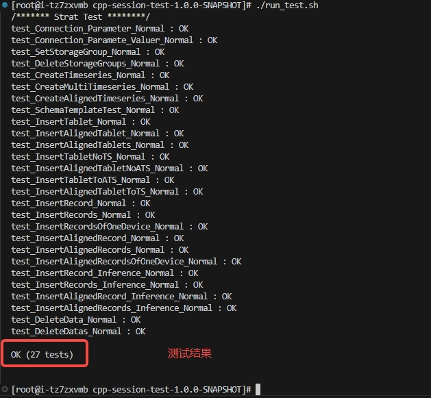
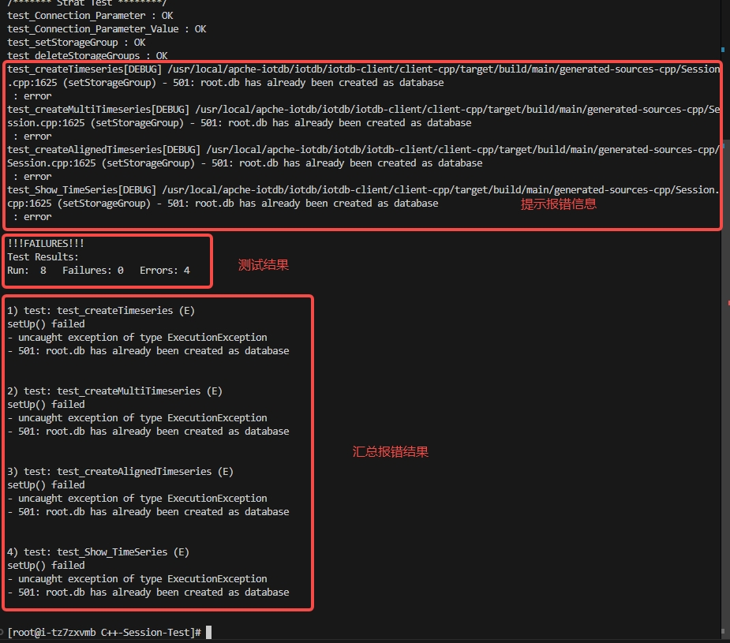

# Cpp-Session-Test说明

-----

## 一、介绍

### 1、目录

```txt
├── assert                      // 静态资源目录
├── build                       // 编译和生成可执行文件目录
├── client                      // 头文件和库文件目录
├── test                        // 测试代码目录
|   ├── CMakeLists.txt          // 测试代码目录的配置文件
├── CMakeLists.txt              // 主配置文件
├── CMakePresets.json           // CMake项目构建配置文件
├── compile.sh                  // 编译脚本
├── README.md                   // 程序说明文档
├── run.sh                      // 执行脚本
```

### 2、编译

拉取iotdb源码并编译生成c++头文件和库文件

```bash
# 拉取
git clone https://github.com/apache/iotdb.git
cd iotdb
# 编译c++（glibc 版本 >= 2.17 的 Linux，更多平台编译详见IoTDB官网）
./mvnw clean package -pl example/client-cpp-example -am -DskipTests -P with-cpp -Diotdb-tools-thrift.version=0.14.1.1-glibc223-SNAPSHOT
# 存放头文件和库文件
头文件位于：iotdb-client/client-cpp/target/client-cpp-2.0.5-SNAPSHOT-cpp-linux-x86_64/include下，存放到Cpp-Session-Test/client/include下
库文件位于：iotdb-client/client-cpp/target/client-cpp-2.0.5-SNAPSHOT-cpp-linux-x86_64/lib下，存放到Cpp-Session-Test/client/lib下
```

第一次需要手动编译gtest生成gtest头文件和库文件，也存放到同样地方下

---

## 二、使用

在根目录下执行命令

```bash
# 编译
./compile.sh
# 执行
./run.sh
```

成功结果如下图所示



出现错误结果如下图所示



