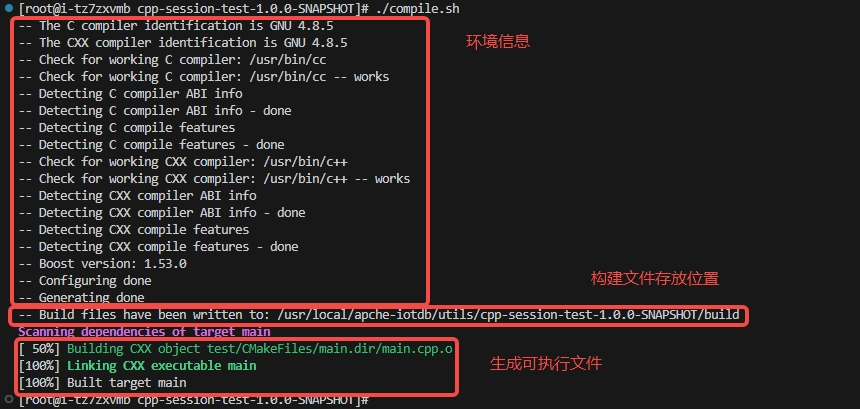

# Cpp-Session-Test说明

-----

## 一、介绍

### 1、目录

```txt
├── assert                      // 静态资源目录
├── build                       // 编译和生成可执行文件目录
├── client                      // 头文件和库文件目录
├── test                        // 测试代码目录
|   ├── CMakeLists.txt          // 测试代码目录的配置文件
├── CMakeLists.txt              // 主配置文件
├── CMakePresets.json           // CMake项目构建配置文件
├── compile.sh                  // 编译脚本
├── README.md                   // 程序说明文档
├── run_test.sh                 // 执行脚本
```

### 2、编译

在项目主目录下执行：`./compile.sh` 命令，输出信息如下。



### 3、执行

在项目主目录下先编译完，然后执行：`./run_test.sh` 命令，输入需要执行的文件名，执行成功信息如下图一，执行失败信息如下图二。


---

## 二、使用

本测试iotdb配置为默认配置（ip为127.0.0.1），在项目主目录下执行命令（用时大约二十秒）

```bash
# 编译
./compile.sh
# 执行
./run_test.sh
```

